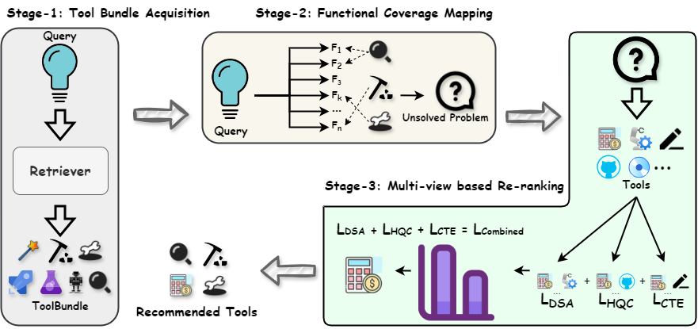

## PTR: Precision-Driven Tool Recommendation for Large Language Models

  

By augmenting Large Language Models (LLMs) with external tools, their capacity to solve complex problems has been significantly enhanced. However, despite ongoing advancements in the parsing capabilities of LLMs, incorporating all available tools simultaneously in the prompt remains impractical due to the vast number of external tools. Consequently, it is essential to provide LLMs with a precise set of tools tailored to the specific task, considering both quantity and quality. Current tool retrieval methods primarily focus on refining the ranking list of tools and directly packaging a fixed number of top-ranked tools as the tool set. However, these approaches often fail to equip LLMs with the optimal set of tools prior to execution, since the optimal number of tools for different tasks could be different, resulting in inefficiencies such as redundant or unsuitable tools, which impede immediate access to the most relevant tools. This paper addresses the challenge of recommending precise toolsets for LLMs. We introduce the problem of tool recommendation, define its scope, and propose a novel Precision-driven Tool Recommendation (PTR) approach. PTR captures an initial, concise set of tools by leveraging historical tool bundle usage and dynamically adjusts the tool set by performing tool matching, culminating in a multi-view-based tool addition. Additionally, we present a new dataset, RecTools, and a metric, TRACC, designed to evaluate the effectiveness of tool recommendation for LLMs. We further validate our design choices through comprehensive experiments, demonstrating promising accuracy across two open benchmarks and our RecTools dataset.

## Usage
**pip install -r requirments.txt**

**Be prepared with your own api key**
